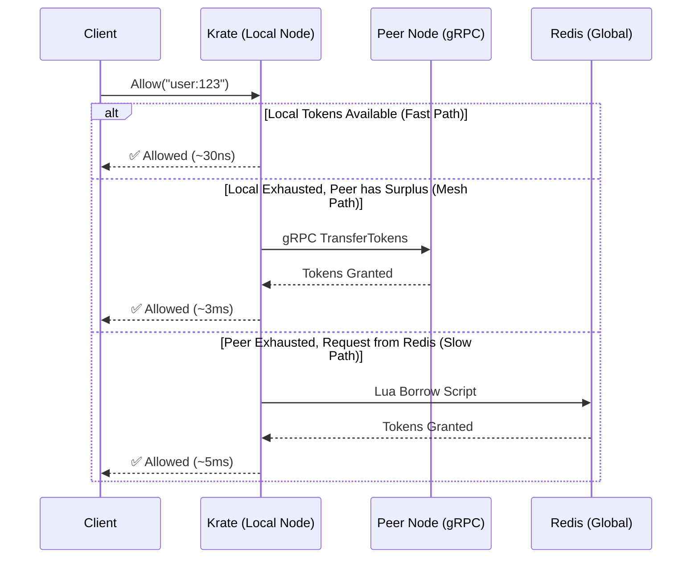

<div align="center">
  

  <br><br>

  **The Ultra-Fast Distributed Rate Limiter for Go**<br><br>
  🚀 **Up to 4,000x Faster Latency** &nbsp;&bull;&nbsp; 📈 **Up to 45x Higher Throughput** &nbsp;&bull;&nbsp; 📉 **99% Less Redis Traffic**<br><br>
  *Powered by Local Token Borrowing, Map-based Top-N Delta Gossip, and Mesh Peer Routing.*
  <br>

  [](https://pkg.go.dev/github.com/krigsherre/krate)
  [](https://goreportcard.com/report/github.com/krigsherre/krate)
  [](https://opensource.org/licenses/MIT)

</div>

---

## ⚡ Why Krate?

Traditional distributed rate limiters hit Redis on **every single request**. At scale, this introduces massive latency (~1ms+ per request), creates a single point of failure, and heavily inflates your infrastructure costs.

**Krate** acts as an intelligent, predictive, local-first proxy that buffers tokens directly in your application memory.

<div align="center">
  <table>
    <tr>
      <td width="50%">
        <h3>🚀 Zero-Redis Hot Path</h3>
        <p>Tokens are consumed locally yielding <b>nanosecond latency</b>. Say goodbye to network bottlenecks on your critical path.</p>
      </td>
      <td width="50%">
        <h3>📉 99% Less Redis Load</h3>
        <p>Background goroutines asynchronously batch-borrow tokens <i>ahead</i> of demand, dramatically cutting cloud bills.</p>
      </td>
    </tr>
    <tr>
      <td width="50%">
        <h3>🌐 Mesh Peer Discovery</h3>
        <p>Instances seamlessly form a cluster, sharing real-time metrics and routing surplus tokens to peers over ultra-fast, compressed gRPC.</p>
      </td>
      <td width="50%">
        <h3>🛡️ Singleflight Optimization</h3>
        <p>Thousands of concurrent requests for the same key trigger only <b>one</b> Redis network call, preventing thundering herds.</p>
      </td>
    </tr>
  </table>
</div>

---

## 🚀 Benchmark Performance (Production Grade)

Krate provides a staggering performance boost over standard Redis rate limiters. In our aggressive benchmark suites, Krate handles millions of requests per second and provides microsecond p50 latencies, but can exhibit higher tail latencies (p99.9) during heavy lock contention for pre-borrowing.

> **Hardware**: Standard developer machine (localhost Redis)<br>
> **Traffic pattern**: Zipfian distribution (real-world skew)<br>
> **Setup**: 4 Instances, 10,000 Keys

### What are we benchmarking?
To prove Krate handles every edge case, we test it against distinct workload profiles:
1. **Global API Gateway (Power-law Traffic)**: 1% of hot keys (e.g., your biggest customers) generate 50% of the total traffic. Tests Krate's ability to cache hot keys aggressively.
2. **Multi-Tenant SaaS (High Concurrency)**: Heavy throughput spread evenly across tenants. Tests amortized borrowing.
3. **Bot IP Throttling (Massive Cardinality)**: Millions of unique IPs with very tight limits (e.g., 60 req/min). Tests how Krate handles memory pressure and rapid eviction.
4. **Mesh Peer-to-Peer Transfer (Zero Redis Fallback)**: Intentionally starves one instance to force it to ask a neighboring peer for tokens via gRPC. Tests the mesh network's ability to keep Redis traffic at 0.

### Throughput & Cost Reduction

| Scenario | Krate Throughput | Redis-Only Throughput | Speedup | Redis Load Reduction |
| :--- | :--- | :--- | :--- | :--- |
| **API Gateway** | <kbd>2.04M req/s</kbd> | 59.5K req/s | <span style="color:green">**34.2x**</span> | **100%** |
| **Multi-Tenant SaaS** | <kbd>2.65M req/s</kbd> | 58.4K req/s | <span style="color:green">**45.5x**</span> | **100%** |
| **Peer Token Flow** | <kbd>907.2K req/s</kbd> | 57.3K req/s | <span style="color:green">**15.8x**</span> | **100%** |
| **IP Throttling** | <kbd>1.04M req/s</kbd> | 59.5K req/s | <span style="color:green">**17.5x**</span> | **98%** |
| **Per-User Limiting** | <kbd>1.42M req/s</kbd> | 58.4K req/s | <span style="color:green">**24.3x**</span> | **99%** |
| **Peer Transfer** | <kbd>191.5K req/s</kbd> | 59.0K req/s | <span style="color:green">**3.2x**</span> | **95%** |

### Latency Profile & The Tail Trade-off

While Krate is up to **4,000x faster** on average (p50), the asynchronous pre-borrowing engine can introduce lock contention at the extreme tail (p99.9). 

| Scenario | Latency p50<br>(Krate / Redis) | Latency p99<br>(Krate / Redis) | Latency p99.9<br>(Krate / Redis) |
| :--- | :--- | :--- | :--- |
| **API Gateway** | **1.9μs** / 6.7ms | **2.6ms** / 9.2ms | **10.3ms** / 22.6ms |
| **Multi-Tenant SaaS** | **1.7μs** / 6.8ms | **3.0ms** / 9.2ms | **11.2ms** / 15.3ms |
| **Peer Token Flow** | **12.8μs** / 1.7ms | **638.8μs** / 2.7ms | **2.1ms** / 7.8ms |
| **IP Throttling** | **2.1μs** / 10.1ms | **4.5ms** / 13.6ms | **12.3ms** / 26.1ms |
| **Per-User Limiting** | **2.0μs** / 6.7ms | **3.4ms** / 11.8ms | **14.5ms** / 38.4ms |
| **Peer Transfer** | **430.7μs** / 3.4ms | **3.6ms** / 4.9ms | **39.6ms** / 8.6ms |

**The Trade-off Verdict**: You are trading extreme tail consistency (which occasionally blocks a goroutine for ~15ms while it waits for a Redis pre-borrow batch to finish) for an overall system throughput increase of **15x-45x+** and a massive reduction in database costs.


---

## 🧠 Architecture & Request Flow

Krate uses a combination of advanced techniques to keep your cluster perfectly in sync without punishing the database. 



### The Secret Sauce

- 🔄 **Adaptive Token Borrowing**: Krate borrows chunks of tokens from Redis. If a key is hot, it pre-borrows *before* running out, ensuring the critical path is strictly in-memory.
- 📊 **Map-Based Top-N Delta Gossiping**: Every instance tracks key consumption locally at the bucket level. These consumption and borrowing statistics are filtered to the Top N hottest keys, and only changes (deltas) are transmitted over the mesh network to peers.
- ⚡ **Peer Forwarding**: If Instance A exhausts its tokens but Instance B has a surplus, Instance A will directly forward the request to Instance B over lightning-fast gRPC, **completely bypassing Redis.**
- 🔀 **Extensible Routing**: Decouples borrowing logic from the request pipeline into a routing package, supporting customizable routing decisions (e.g. standard fallback, custom priority trees, or ML-based predictions).
- 🧹 **Automatic Inactive Lease Cleanup**: Key state is kept alive via lease-based expiration. Any borrowed state inactive for longer than the lease TTL is automatically purged, preventing memory leaks.
- 🤐 **gRPC Transport Compression**: Enables gzip compression on mesh connections, minimizing network bandwidth when gossiping states.

---

## 🛠 Installation

```bash
go get github.com/krigsherre/krate
```

## 💻 Quick Start

Drop Krate into your existing Go application with just a few lines of code:

```go
package main

import (
	"context"
	"fmt"
	"time"

	"github.com/krigsherre/krate"
	"github.com/redis/go-redis/v9"
)

func main() {
	rdb := redis.NewUniversalClient(&redis.UniversalOptions{
		Addrs: []string{"localhost:6379"},
	})

	limiter, err := krate.New(rdb,
		krate.WithLimit(10000),             // 10,000 requests
		krate.WithWindow(time.Minute),      // per minute
		krate.WithPeerListen(":7100"),      // Start gRPC server for peer mesh
		krate.WithGossipInterval(100 * time.Millisecond),
	)
	if err != nil {
		panic(err)
	}
	defer limiter.Close()

	ctx := context.Background()

	// ⚡ Allow() returns in ~30ns! 
	allowed, err := limiter.Allow(ctx, "user:123")
	if err != nil {
		panic(err)
	}

	if allowed {
		fmt.Println("Request allowed!")
	} else {
		fmt.Println("Rate limit exceeded.")
	}
}
```

---

## ⚙️ Advanced Configuration

Krate is highly tunable for your specific workload:

<details>
<summary><b>Click to expand configuration options & workload recipes</b></summary>

<br>

### 🎛️ Tunable Options
*   `WithPreBorrowThreshold(float64)`: Triggers async background fetch when tokens dip below this percentage (e.g., `0.2` for 20%).
*   `WithProbeK(int)`: The number of healthy peers to query via gRPC when falling back to peer borrowing (Mesh mode).
*   `WithMaxGossipKeys(int)`: The maximum number of keys to include in gossip payloads (limits payload to Top N hottest keys).
*   `WithRouter(routing.Router)`: Plug in custom routing strategies for token acquisition.
*   `WithMetrics(prometheus.Registerer)`: Easily export deep insights into cache hits, Redis latency, and peer forwarding.

### 🍳 Workload Recipes

**1. API Gateway (Power-law / Zipfian Traffic)**
For massive, uneven traffic where 1% of keys handle 50% of the load, aggressive pre-borrowing keeps the hot path purely in-memory:
```go
krate.WithPreBorrowThreshold(0.3), // Fetch early (at 30% remaining)
krate.WithMaxBorrow(2500),         // Allow large batch borrows for hot keys
```

**2. IP Throttling (Massive Cardinality, Bot Tail)**
For millions of unique IPs with low limits (e.g., 60 req/min), prioritize mesh peer discovery over heavy Redis writes:
```go
krate.WithProbeK(3),               // Query 3 peers before falling back to Redis
krate.WithPreBorrowThreshold(0.1), // Delay background fetches for low-frequency IPs
krate.WithMaxBorrow(15),           // Keep batch borrows small to prevent token hoarding
```

**3. Multi-Tenant SaaS (High Throughput per Tenant)**
When dealing with tight, high-volume limits per tenant, you want fast gossip state propagation:
```go
krate.WithGossipInterval(100 * time.Millisecond), // Fast state propagation
krate.WithMaxGossipKeys(500),                     // Gossip Top 500 hot tenants
```

</details>

---

## 🤝 Contributing

Contributions, issues, and feature requests are welcome! Feel free to check the [issues page](https://github.com/krigsherre/krate/issues).

## 📄 License

This project is [MIT](https://opensource.org/licenses/MIT) licensed.
