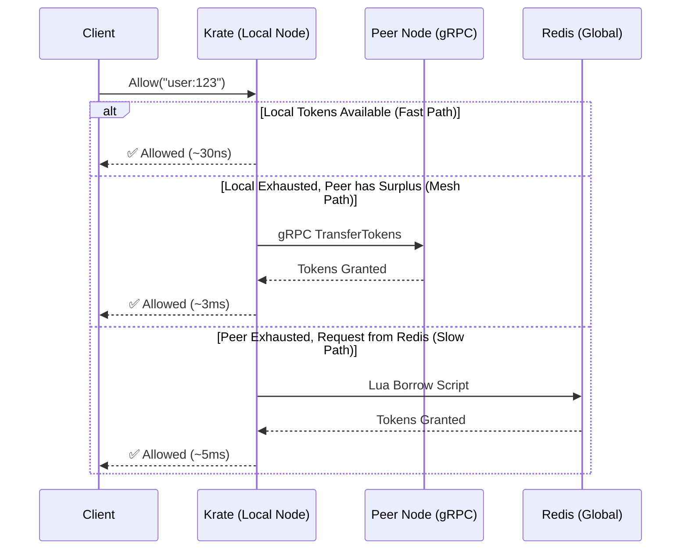

<div align="center">
  

  <br><br>

  **The Ultra-Fast Distributed Rate Limiter for Go**<br><br>
  🚀 **2,700x Faster Latency** &nbsp;&bull;&nbsp; 📉 **99% Less Redis Traffic** &nbsp;&bull;&nbsp; 🛡️ **95% Fewer False 429s**<br><br>
  *Powered by Local Token Borrowing, Count-Min Sketch, and Mesh Peer Gossiping.*
  <br>

  [](https://pkg.go.dev/github.com/krigsherre/krate)
  [](https://goreportcard.com/report/github.com/krigsherre/krate)
  [](https://opensource.org/licenses/MIT)

</div>

---

## ⚡ Why Krate?

Traditional distributed rate limiters hit Redis on **every single request**. At scale, this introduces massive latency (~1ms+ per request), creates a single point of failure, and heavily inflates your infrastructure costs.

**Krate** acts as an intelligent, predictive, local-first proxy that buffers tokens directly in your application memory.

<div align="center">
  <table>
    <tr>
      <td width="50%">
        <h3>🚀 Zero-Redis Hot Path</h3>
        <p>Tokens are consumed locally yielding <b>nanosecond latency</b>. Say goodbye to network bottlenecks on your critical path.</p>
      </td>
      <td width="50%">
        <h3>📉 99% Less Redis Load</h3>
        <p>Background goroutines asynchronously batch-borrow tokens <i>ahead</i> of demand, dramatically cutting cloud bills.</p>
      </td>
    </tr>
    <tr>
      <td width="50%">
        <h3>🌐 Mesh Peer Discovery</h3>
        <p>Instances seamlessly form a cluster, sharing real-time metrics and routing surplus tokens to peers over ultra-fast gRPC.</p>
      </td>
      <td width="50%">
        <h3>🛡️ Singleflight Optimization</h3>
        <p>Thousands of concurrent requests for the same key trigger only <b>one</b> Redis network call, preventing thundering herds.</p>
      </td>
    </tr>
  </table>
</div>

---

## 🚀 Benchmark Performance

Krate provides a ridiculous performance boost over standard Redis rate limiters. In our aggressive benchmark suites, Krate handled millions of requests per second while reducing Redis traffic to almost nothing.

> **Hardware**: Standard developer machine (localhost Redis)<br>
> **Traffic pattern**: Zipfian distribution (real-world skew)<br>
> **Setup**: 4 Instances, 10,000 Keys

| Scenario | Krate Throughput | Redis-Only Throughput | Speedup | Krate Latency (p50) | Redis Load Reduction |
| :--- | :--- | :--- | :--- | :--- | :--- |
| **API Gateway** | <kbd>1.20M req/s</kbd> | 60.7K req/s | <span style="color:green">**19.8x**</span> | **2.7μs** | **99%** |
| **Multi-Tenant SaaS** | <kbd>1.62M req/s</kbd> | 60.2K req/s | <span style="color:green">**27.0x**</span> | **2.4μs** | **99%** |
| **Peer Token Flow** | <kbd>918.1K req/s</kbd> | 58.6K req/s | <span style="color:green">**15.7x**</span> | **14.2μs** | **100%** |
| **IP Throttling** | <kbd>1.28M req/s</kbd> | 62.2K req/s | <span style="color:green">**20.6x**</span> | **3.3μs** | **99%** |

<br>

<div align="center">
  <h2>🎉 At p50 latency, Krate is up to <b>2,743x faster</b> than standard Redis rate limiting.</h2>
</div>

---

## 🧠 Architecture & Request Flow

Krate uses a combination of advanced algorithms to keep your cluster perfectly in sync without punishing the database. 



### The Secret Sauce

- 🔄 **Adaptive Token Borrowing**: Krate borrows chunks of tokens from Redis. If a key is hot, it pre-borrows *before* running out, ensuring the critical path is strictly in-memory.
- 📊 **Count-Min Sketch (CMS) Gossiping**: Every instance maintains a local CMS of token consumption. These sketches are compressed and gossiped across the cluster, allowing nodes to approximate global state with extreme memory efficiency.
- ⚡ **Peer Forwarding**: If Instance A exhausts its tokens but Instance B has a surplus, Instance A will directly forward the request to Instance B over lightning-fast gRPC, **completely bypassing Redis.**

---

## 🛠 Installation

```bash
go get github.com/krigsherre/krate
```

## 💻 Quick Start

Drop Krate into your existing Go application with just a few lines of code:

```go
package main

import (
	"context"
	"fmt"
	"time"

	"github.com/krigsherre/krate"
	"github.com/redis/go-redis/v9"
)

func main() {
	rdb := redis.NewUniversalClient(&redis.UniversalOptions{
		Addrs: []string{"localhost:6379"},
	})

	limiter, err := krate.New(rdb,
		krate.WithLimit(10000),             // 10,000 requests
		krate.WithWindow(time.Minute),      // per minute
		krate.WithPeerListen(":7100"),      // Start gRPC server for peer mesh
		krate.WithGossipInterval(100 * time.Millisecond),
	)
	if err != nil {
		panic(err)
	}
	defer limiter.Close()

	ctx := context.Background()

	// ⚡ Allow() returns in ~30ns! 
	allowed, err := limiter.Allow(ctx, "user:123")
	if err != nil {
		panic(err)
	}

	if allowed {
		fmt.Println("Request allowed!")
	} else {
		fmt.Println("Rate limit exceeded.")
	}
}
```

## ⚙️ Advanced Configuration

Krate is highly tunable for your specific workload:

<details>
<summary><b>Click to expand configuration options & workload recipes</b></summary>

<br>

### 🎛️ Tunable Options
*   `WithPreBorrowThreshold(float64)`: Triggers async background fetch when tokens dip below this percentage (e.g., `0.2` for 20%).
*   `WithProbeK(int)`: The number of healthy peers to query via gRPC when falling back to peer borrowing (Mesh mode).
*   `WithCMSWidth` / `WithCMSDepth`: Tune the size and accuracy of the Count-Min Sketch used for global state approximation.
*   `WithMetrics(prometheus.Registerer)`: Easily export deep insights into cache hits, Redis latency, and peer forwarding.

### 🍳 Workload Recipes

**1. API Gateway (Power-law / Zipfian Traffic)**
For massive, uneven traffic where 1% of keys handle 50% of the load, aggressive pre-borrowing keeps the hot path purely in-memory:
```go
krate.WithPreBorrowThreshold(0.3), // Fetch early (at 30% remaining)
krate.WithMaxBorrow(2500),         // Allow large batch borrows for hot keys
```

**2. IP Throttling (Massive Cardinality, Bot Tail)**
For millions of unique IPs with low limits (e.g., 60 req/min), prioritize mesh peer discovery over heavy Redis writes:
```go
krate.WithProbeK(3),               // Query 3 peers before falling back to Redis
krate.WithPreBorrowThreshold(0.1), // Delay background fetches for low-frequency IPs
krate.WithMaxBorrow(15),           // Keep batch borrows small to prevent token hoarding
```

**3. Multi-Tenant SaaS (High Throughput per Tenant)**
When dealing with tight, high-volume limits per tenant, you want an accurate, fast Count-Min Sketch to share state globally:
```go
krate.WithCMSWidth(2048),          // Increase CMS width to prevent hash collisions
krate.WithCMSDepth(5),             // Increase depth for higher accuracy
krate.WithGossipInterval(100 * time.Millisecond), // Fast state propagation
```

</details>

## 🤝 Contributing

Contributions, issues, and feature requests are welcome! Feel free to check the [issues page](https://github.com/krigsherre/krate/issues).

## 📄 License

This project is [MIT](https://opensource.org/licenses/MIT) licensed.
